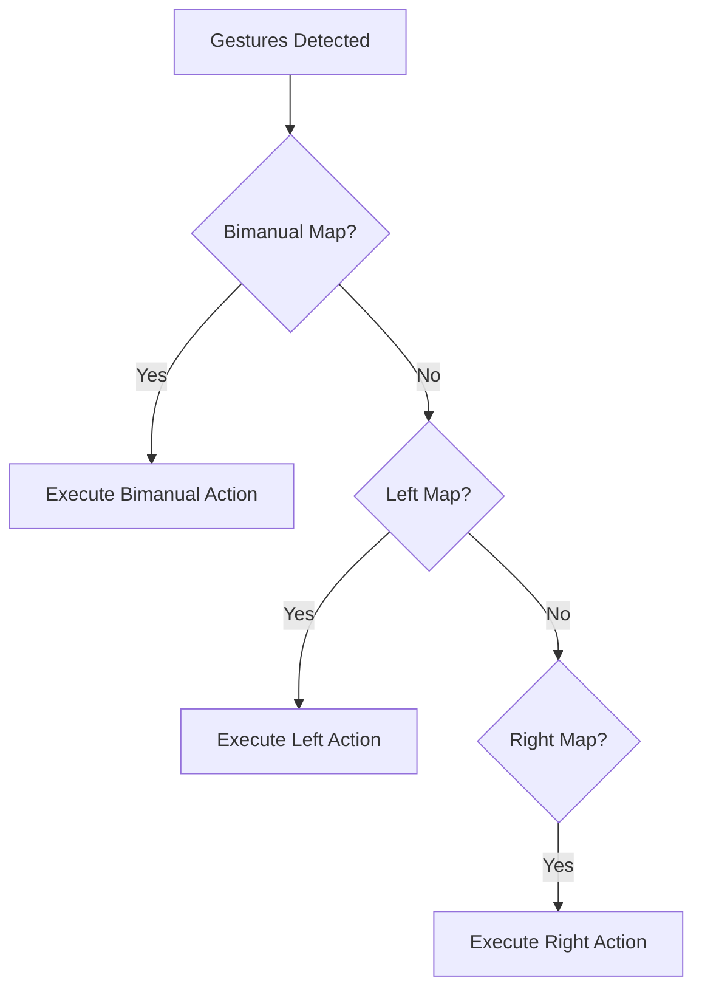

# Action Dispatcher Module

## Overview
The **Action Dispatcher** (`action_dispatcher.py`) is the decision-making engine of the HANDS system. It replaces hardcoded behavior logic with a flexible, configuration-driven approach.

## Implementation Details
It employs the **Command Pattern** and **Dispatcher Pattern**:
1.  **Input**: Detected gestures from Left and Right hands.
2.  **Lookup**: Uses O(1) Hash Maps to find a matching entry in the `action_map`.
3.  **Command**: Executes the corresponding method in `SystemController`.

### Logic Flow

## Key Classes
*   **`ActionDispatcher`**: The main class.
    *   `load_map(list)`: Optimizes the JSON config list into lookups.
    *   `dispatch(left, right, meta)`: The runtime trigger.

## Educational Concept: Data-Driven Design
Instead of writing logic like `if gesture == "wave": wave()`, we define *Data*: `{"wave": "wave_function"}`. The engine is generic and doesn't know what "wave" means—it just matches strings to functions. This allows users to change behaviors without changing code.
